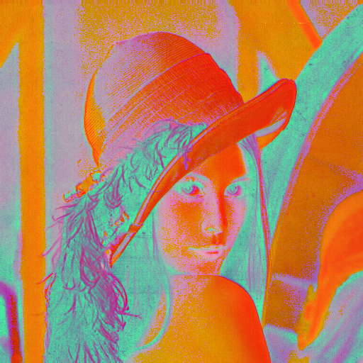
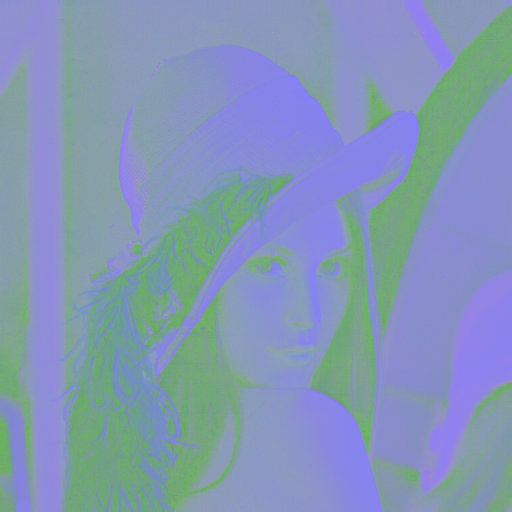
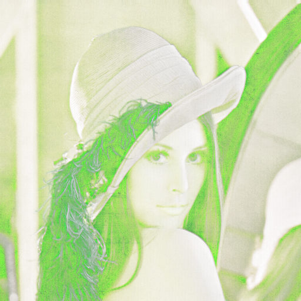
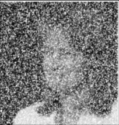
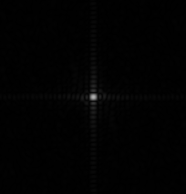
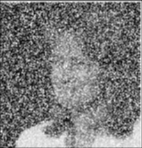
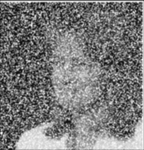
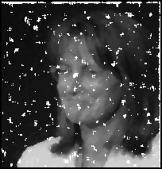

## Introduction
This document provides an overview and explanation for three distinct image processing scripts: color space conversions, Fourier transform with a Gaussian filter, and image convolution/correlation with several filter types.

## Color Space Conversions

### Overview:
This script allows you to convert an RGB image into HSV, LAB, and CMYK color spaces.

### Methods:
1. **`rgb_to_hsv(image)`**:
    * **Input**: RGB image
    * **Output**: HSV image
    * **Functionality**: Converts RGB values to HSV format. 
2. **`rgb_to_lab(image)`**:
    * **Input**: RGB image
    * **Output**: LAB image
    * **Functionality**: Converts RGB values to LAB format using XYZ color space as an intermediary.
3. **`rgb_to_cmyk(image)`**:
    * **Input**: RGB image
    * **Output**: CMYK image
    * **Functionality**: Converts RGB values to CMYK format.

### Example Usage:
```
img = cv2.imread('Lenna.png').astype('float32') / 255.0
HSV_img = rgb_to_hsv(img)
```

 

```
img = cv2.imread('Lenna.png').astype('float32') / 255.0
Lab_img = rgb_to_lab(img)
```



```
img = cv2.imread('Lenna.png').astype('float32') / 255.0
CMYK_img = rgb_to_cmyk(img)
```



## Fourier Transform with Gaussian Filter

### Overview:
This script demonstrates how to apply a Fourier transform to an image and then filter it using a Gaussian filter.

### Methods:
1. **`fourier_transform(image, s)`**:
    * **Input**: Grayscale image and sigma (s) for the Gaussian filter.
    * **Output**: Processed image after inverse DFT and its magnitude spectrum.
    * **Functionality**: Performs padding, DFT, creates a Gaussian filter, applies the filter, and then computes the inverse DFT.

### Example Usage:
```
img = cv2.imread('Noisy_image.png', 0)
image, dft = fourier_transform(img, s=220)
```

 



## Image Convolution and Correlation

### Overview:
This script provides functions for convolution, correlation, a median filter, and gamma correction.

### Methods:
1. **`convolve(image, kernel)`**:
    * **Input**: Image and convolution kernel.
    * **Output**: Convolved image.
    * **Functionality**: Convolves the image with the given kernel.
2. **`correlate(image, kernel)`**:
    * **Input**: Image and kernel.
    * **Output**: Correlated image.
    * **Functionality**: Correlates the image with the given kernel.
3. **`median_filter5x5(image)`**:
    * **Input**: Image.
    * **Output**: Image after applying a 5x5 median filter.
    * **Functionality**: Applies a 5x5 median filter to the image.
4. **`gamma(image, g)`**:
    * **Input**: Image and gamma value.
    * **Output**: Gamma corrected image.
    * **Functionality**: Adjusts the image according to the given gamma value.

### Example Usage:
```
conv_filter = np.ones((3,3)) / 9
conv_img = convolve(img, conv_filter)
```

 

```
conv_filter = np.ones((3,3)) / 9
avg_img = correlate(img, conv_filter)
```



```
g_filter = np.array([[1.0, 2.0, 1.0], [2.0, 4.0, 2.0], [1.0, 2.0, 1.0]]) / 16
g_img = correlate(img, g_filter)
```



```
m_img = median_filter5x5(img)
```



```
img = cv2.imread('Uexposed.png', 0)
gamma_img = gamma(img, 0.4)
```


